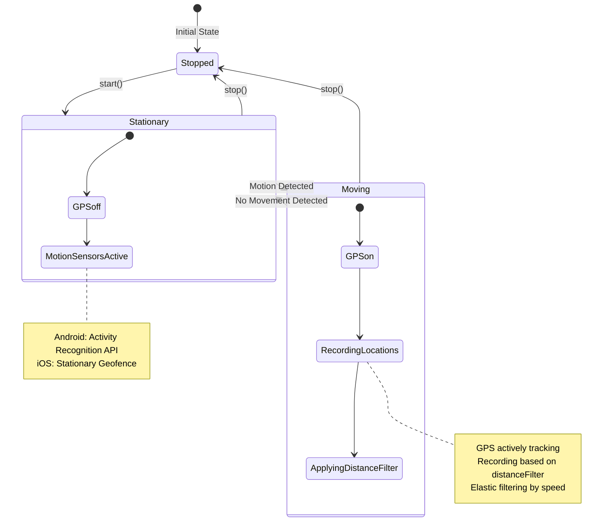
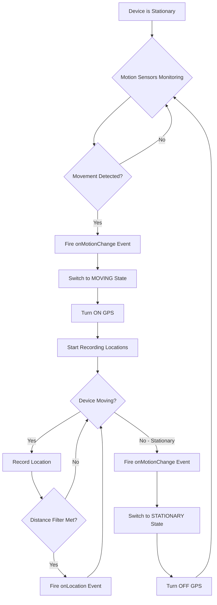
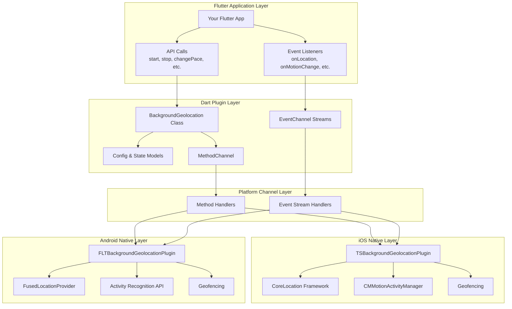
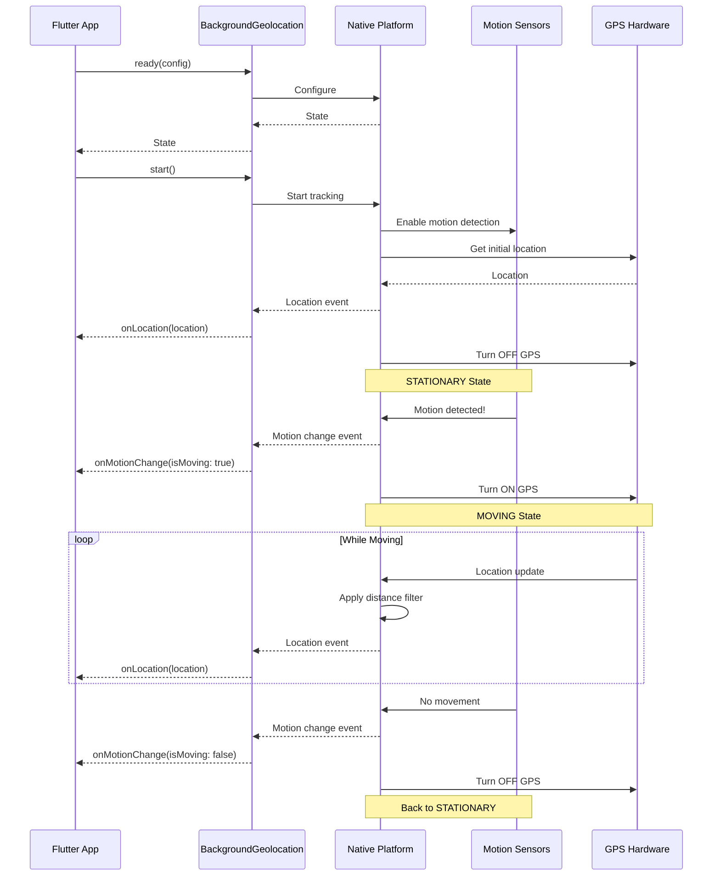
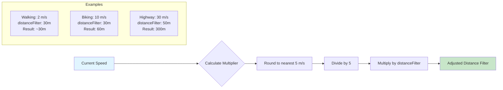
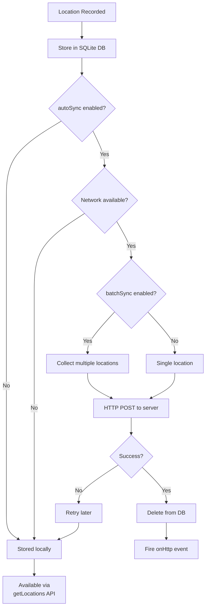
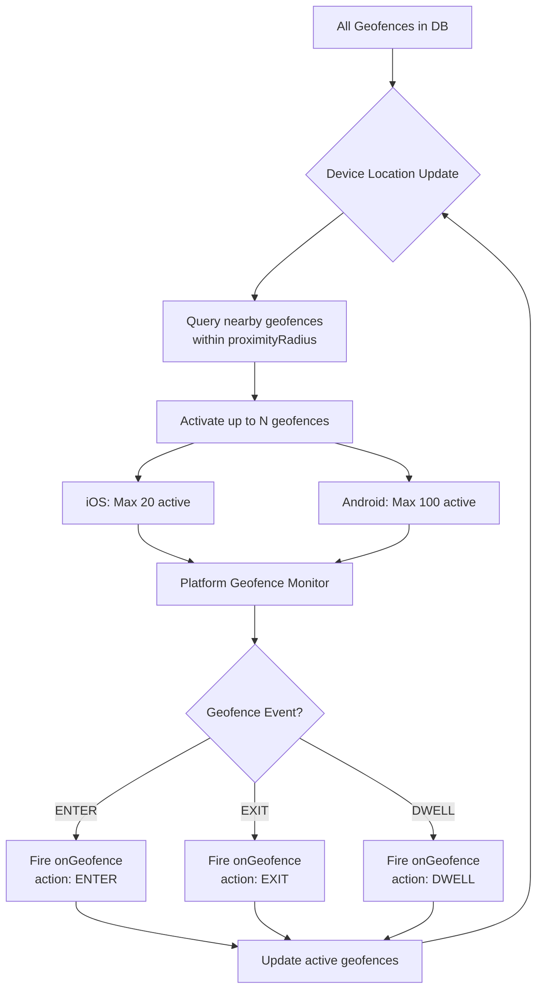
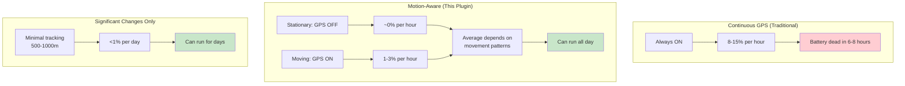
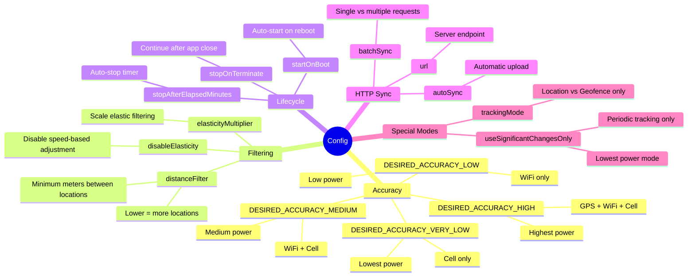

# Background Location Tracking - Visual Diagrams

This document contains visual diagrams to help understand how the flutter_background_geolocation plugin works.

## State Machine Diagram

## Motion Detection Flow

## Plugin Architecture Layers

## Event Flow Sequence

## Elastic Distance Filtering

## Location Persistence & Sync Flow

## Geofencing System

## Battery Consumption Comparison

## Configuration Options Impact

## Common Use Case: Delivery Driver

```mermaid
gantt
    title Delivery Driver - GPS Activity During 8 Hour Shift
    dateFormat HH:mm
    axisFormat %H:%M
    
    section GPS Status
    OFF (At Home)           :done, 08:00, 09:00
    ON (Driving to store)   :active, 09:00, 09:15
    OFF (In store)          :done, 09:15, 09:30
    ON (Driving delivery 1) :active, 09:30, 09:45
    OFF (Customer stop)     :done, 09:45, 09:50
    ON (Driving delivery 2) :active, 09:50, 10:05
    OFF (Customer stop)     :done, 10:05, 10:10
    ON (Driving delivery 3) :active, 10:10, 10:30
    OFF (Lunch break)       :done, 10:30, 11:00
    
    section Battery Impact
    ~0% drain               :08:00, 09:00
    2-3% used              :09:00, 09:15
    ~0% drain              :09:15, 09:30
    2% used                :09:30, 09:45
    ~0% drain              :09:45, 09:50
    2% used                :09:50, 10:05
    ~0% drain              :10:05, 10:10
    3% used                :10:10, 10:30
    ~0% drain              :10:30, 11:00
```

---

**Note:** These diagrams use [Mermaid](https://mermaid.js.org/) syntax and will render automatically in GitHub, GitLab, and many markdown viewers. If viewing in an editor that doesn't support Mermaid, you can paste the diagram code into the [Mermaid Live Editor](https://mermaid.live/) to view them.

## How to Use These Diagrams

1. **State Machine**: Understand the core states and transitions
2. **Motion Detection Flow**: Follow how the plugin detects and responds to movement
3. **Architecture Layers**: See how the plugin is structured from Flutter to native
4. **Event Flow**: Understand the sequence of events during tracking
5. **Elastic Filtering**: Visualize how distance filtering adapts to speed
6. **Persistence & Sync**: Follow data flow from capture to server
7. **Geofencing**: Understand proximity-based geofence activation
8. **Battery Comparison**: Compare power consumption across modes
9. **Configuration Impact**: Explore how settings affect behavior
10. **Use Case Example**: See real-world GPS on/off patterns

These diagrams complement the [ARCHITECTURE.md](./ARCHITECTURE.md) and [HOW_IT_WORKS.md](./HOW_IT_WORKS.md) documentation.
